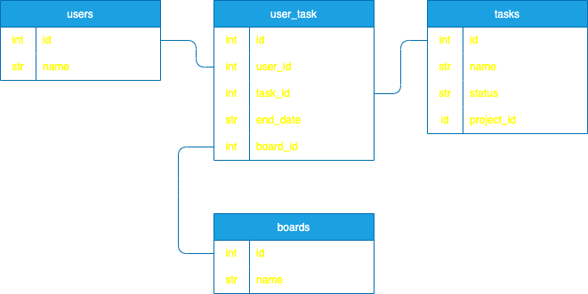
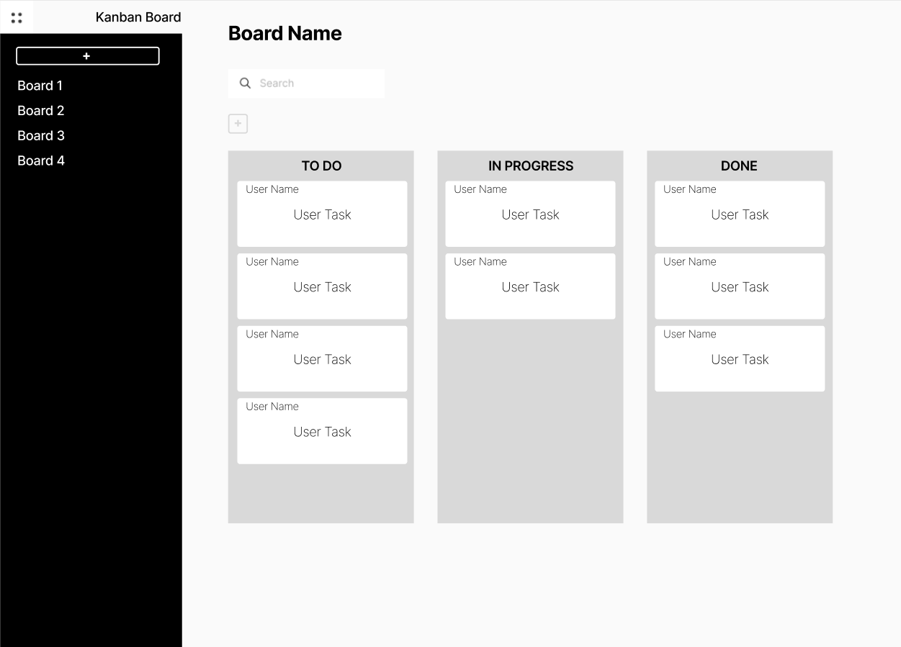
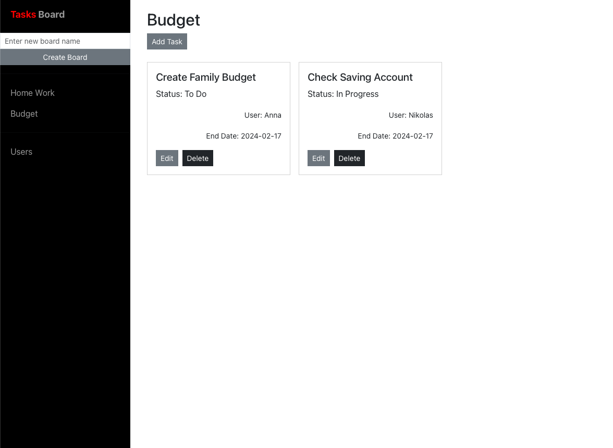
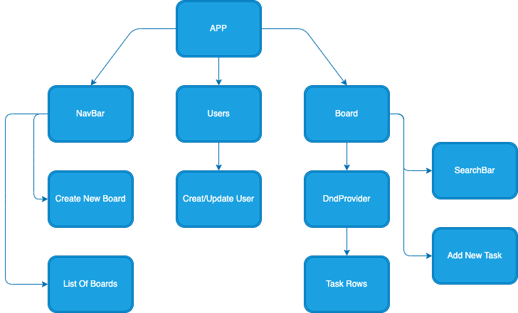

# PROJECT PITCH
### Project Name: Kanban Board
### Owner: Igor Rakush

### App description:
Project management tool designed to help visualize work progress.

### CRUD User Story

As a user, I want to be able to create, read, update and delete my project tasks as well as create tasks for other users .


## Installation Instructions
To download the dependencies for the frontend and backend, run:
```
pipenv install
pipenv shell
npm install --prefix client
```
You can run your Flask API on localhost:5555 Links to an external site. by running:
```
python server/app.py
```
You can run your React app on localhost:4000 Links to an external site. by running:
```
npm start --prefix client
```

## BACKEND (Flask)

## Data flow visualizations: 
### ERD Database Table:

The entity relationship database is illustrated here:




### MODELS
* many-to-many relationship
* A `User` has many `Task`s through `User_Task`s
* A `Task` has many `User`s through `User_Task`s
* A `User_Task` belongs to a `User` , `Task` and `Board`
* * A `Board` has many `User_Task`s 


### VALIDATIONS 
* Add validations to the `User` model:
* - must have a `name`
* Add validations to the `Task` model:
* - must have a `nam`' and `project_id``
* Add validations to the `Board` model:
* - must have a `name`
* Add validations to the `User_Task` model:
* - must have a `end_date` and be equal to or greater than Today

## API Routes

**User**
```
GET /user/
POST /user/
```

```
GET /user/<int:id>
PATCH /user/<int:id>
DELETE /user/<int:id>
```
**Task**
```
GET /task/
POST /task/
```

```
GET /task/<int:id>
PATCH /task/<int:id>
DELETE /task/<int:id>
```
**Board**
```
GET /board/
POST /board/
```

```
GET /board/<int:id>
PATCH /board/<int:id>
DELETE /board/<int:id>
```

## FRONTEND (REACT)





## Component Hierarchy


## Component Details

Navbar: Navigation bar includes 'Create new board' The ability to create a new board by project. 'List Of Boards' Displays a list of all boards.

Users: Serves for administration of application users. It displays a list of all users and also provides the ability to create / edit and delete a user from the application.

Board: The main component where all the magic happens. .... (complete the component description)

## React Routes

/home: The home page displays the first board in the list.

/users: This page displays a list of all users. You can create, edit and delete users on this page.

/board/id: The Board page displays all user tasks for the project.


---
---
---

- Add Figma wireframe
- Which components will make requests to your API?  
- Discribe routes


EXTRA!  
Stretch goals:
- Search
- Add new `progress` column 
-